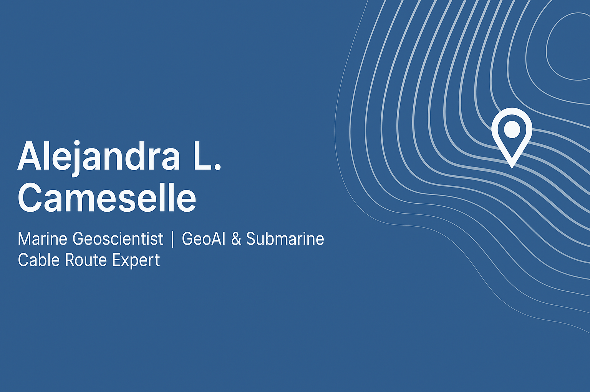

# 👋 Hi, I’m Alejandra L. Cameselle

I’m a marine geoscientist and data scientist focused on submarine cable route design, seafloor risk assessment, and spatial AI applications.

Through **GeoAI Works**, I explore how to transform geospatial data into actionable insights for sustainable infrastructure and marine operations.

### 🔬 Current focus
- Submarine cable burial feasibility
- Seafloor complexity classification using bathymetry & slope
- GeoAI and spatial risk models

### 🧰 Tools & domains
`Python` · `GeoPandas` · `QGIS` · `PostGIS` · `Machine Learning`  
`Bathymetric analysis` · `Route engineering` · `Operational risk mapping` · `Geospatial analytics`

---

📍 Founder of **[GeoAI Works](https://www.linkedin.com/company/geoai-works/)**  
📫 Connect with me on [LinkedIn](https://www.linkedin.com/in/alejandralcameselle/)  
📂 Check out my portfolio: [GeoAI Works on GitHub](https://github.com/GeoAI-Works)
